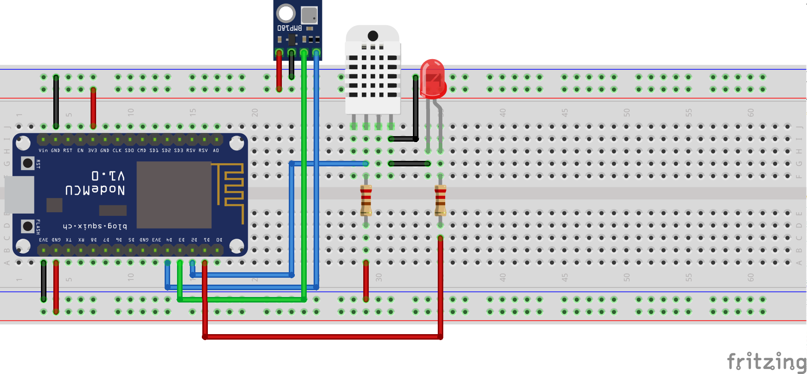

# NodeMCU Weather Station

This example collects data from sensors and send it to Thingspeak's api.

## Instructions:
 - Update the file [init.lua](src/init.lua#L17) init.lua with your thingsspeak's api token.
 - Upload the files to the nodeMCU.

## Materials:
 - 1x Led
 - 1x BMP180 - Barometric Pressure Sensor
 - DHT22 - Humidity and Temperature Sensor
 - 2x 220Ω Resistor
 - 1x NodeMCU - ESP8266

##Breadboard

